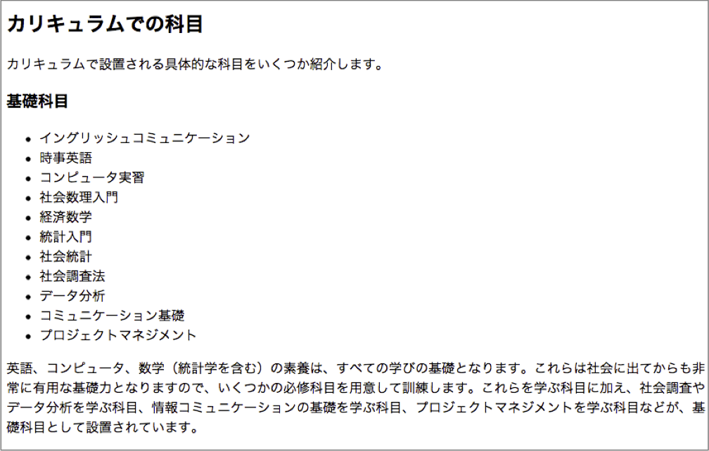
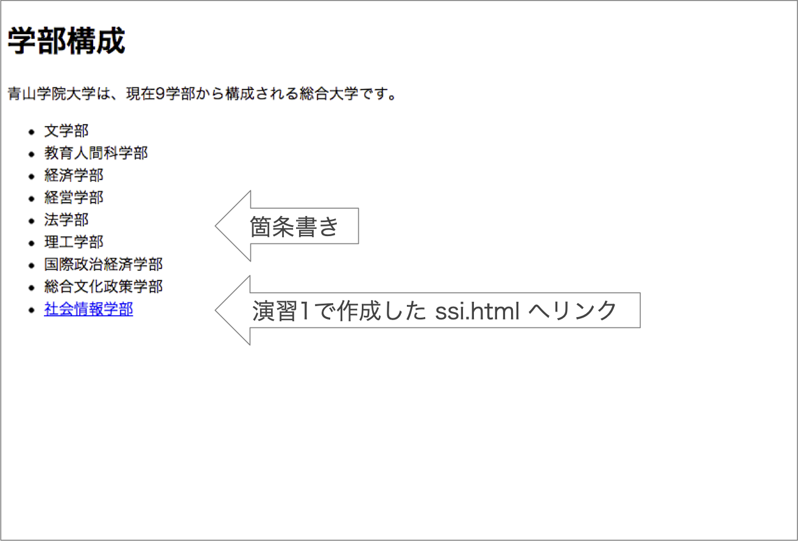

# HTMLの基本

本章では，HTMLファイル作成の基本について学びます．  
初学者用Webページ開発環境（pikeplace - kenya）を使って学習を進めます．  
基本的な使い方はsumatraに準じています．  


## 最初のページ（最小限の構成）
まずはkenyaにログインし，新しいフォルダを「Sample01」という名称で作成してください．  
その後，新しいファイルを「index.html」という名称で作成してください．  
HTMLファイルは「.html」という拡張子を使用します。  
index.htmlを作成したら，次の「source」のように編集してください．  

<div code src='1-1'></div>

### タグ
- 文章にタグを付けて構造を表す
- タグは &lt; と &gt; でくくる
    - ```<タグ名>ここに文章が入る</タグ名>```
- 「開始タグ」と「終了(閉じ)タグ」で囲まれた範囲にタグが示す構造(要素)を適用
- 終了タグが無いものも存在

- タグにはオプション指定できるものもある
    - ```<タグ名 要素名1＝”属性A” 要素名2＝”属性B”>```

### head部でよく使うタグ
```
<meta charset="UTF-8">
<meta name="description" content="HTML練習">

<title>HTMLの練習</title>

<link rel="shortcut icon" href="myfavicon.ico">
<link rel="stylesheet" href="mystyle.css">
<script src="myscript.js"></script>
```

### コメント
```
<!-- これはコメントです -->
```

- &lt;!-- と --&gt;で囲まれた部分はコメント，解釈・表示されない

### 実体参照

<!-- | 文字           | 実体参照       | 説明            |
:--|:-:|--:
| &lt; | &amp;lt;         | 小なり記号       |
| &gt; | &amp;gt;         | 大なり記号  |
| &amp;| &amp;amp;         | アンド記号    |
| &quot;| &amp;quot;  | ダブルクォーテーション    |
: 特殊記号の表示 -->

<table class="mtable" style="margin-left: 100px;">
<tr>
    <td class="mtd">文字</td>
    <td class="mtd">実体参照</td>
    <td class="mtd" style="width: 200px;">説明</td>
</tr>
<tr>
    <td>&lt;</td><td>&amp;lt;</td><td>小なり記号</td>
</tr>
<tr>
    <td>&gt;</td><td>&amp;gt;</td><td>大なり記号</td>
</td>
<tr>
    <td>&amp;</td><td>&amp;amp;</td><td>アンド記号</td>
</tr>
<tr>
    <td>&quot;</td><td>&amp;quot;</td><td>ダブルクォーテーション</td>
</tr>
</table>

## body部で利用するタグ

<div code src='1-2'></div>

- 見出しは h1（大見出し） から h6（小見出し） まで．  
- パラグラフは&lt;p> &lt;/p>でくくる．
- 希望位置で改行したい場合には&lt;br>を利用（閉じタグ無し）．

### 画像を貼る

画像を利用する場合には事前にWebサーバにアップロードしておく必要があります．  
本演習では，以下の手順でkenyaサーバに画像をアップロードしておきます．  

1. 「up」をクリックする
1. 「ファイルを選択」をクリックし，画像をアップロードする
1. アップロードされたことを確認する


その後，以下のように&lt;img&gt;タグを用いて画像を貼ります．

<div code src='1-7'></div>
- srcにファイル名を，altには画像の説明を付ける
- 画像ファイルは，GIF, JPEG, PNGの形式


### リンクする

<div code src='1-3'></div>

- オプション target="_blank" を付けると別ウィンドウ（タブ）で開く

### 箇条書き

<div code src='1-4'></div>


### 段落番号

<div code src='1-5'></div>

- ul : Unordered List (順序のないリスト) → 箇条書きリスト  
- ol : Ordered List (順序のあるリスト) → 番号付きリスト  
- li : List Item (リストの項目)

### 表

<div code src='1-6'></div>


- tr : 行の指定
- th : 見出しの指定  
- td : 列（データ）の指定  

### その他：学習に関して
- 日常的に作業しない場合，全てのタグやオプションを覚えることは困難
  - 必要に応じて調べながら使えれば良い
- 例題の多い辞書的なサイトが参考に
  - HTMLクイックリファレンス　[http://www.htmq.com/](http://www.htmq.com/) 
  - HTML5やCSSプロパティなど
- お手本となるサイトのソースを覗く
  - 実際のイメージから，どのように実現しているのか


# 練習問題
## 練習問題8-1
配布ファイルssi.txtの内容を使い，以下の表示例と同様の出力が可能なssi.htmlを作成せよ

- 表示例（1）
  - 
- 表示例（2）
  - 
- 表示例（3）
  - 
- 表示例（4）
  - 
- 表示例（5）
  - 
- ただし，見出しの設定と表の構成は次に従うこと
  - 見出しの設定
    - h1 :「社会情報学部の教育」
    - h2 :「学際的融合領域を学ぶ」「カリキュラムでの科目」
    - h3 : それ以外の見出し部分
  - 表示例（4）の表の構成
    - 表の周りの線や色が無いためわかりづらいので，わかりやすくするために色づけした表を以下に示す
	- このように3行2列の表を作成する（実際には色付けは不要である）
	  - 
 - 表示例（5）の表も同様に2行3列である
 - どの行にどの科目が入るのかは，ssi.txtファイルを参照すること

## 練習問題8-2
3つのHTMLファイルからなる青山学院大学を説明するWebページを作成せよ

- ただし、文章はagu.txtを利用すること
- ページの構成は以下のようにすること
  - index.html : トップページ
  - dept.html : 学部について書かれたページ
  - history.html : 沿革について書かれたページ
  - test.jpg ; [https://xxxx.xxxx.xxxx.xxxx/test.jpg](https://xxxx.xxxx.xxxx.xxxx/test.jpg)を利用する
- index.htmlの表示例
  - 
- history.htmlの表示例
  - 
- dept.htmlの表示例
  - 


