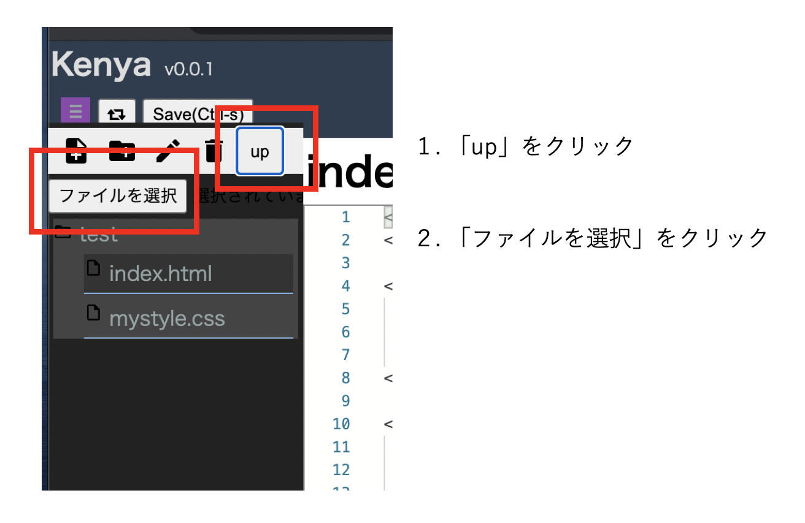
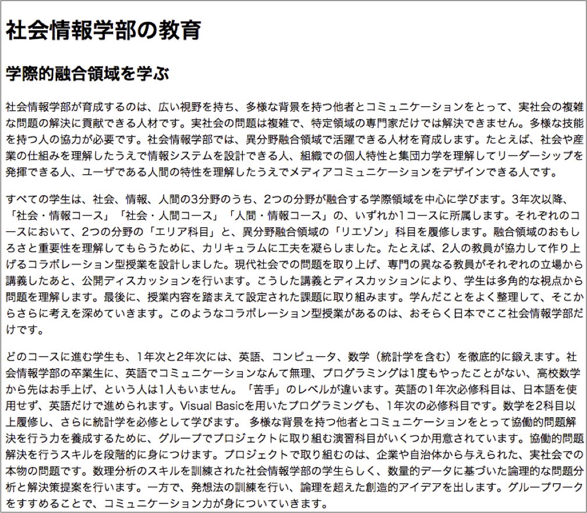
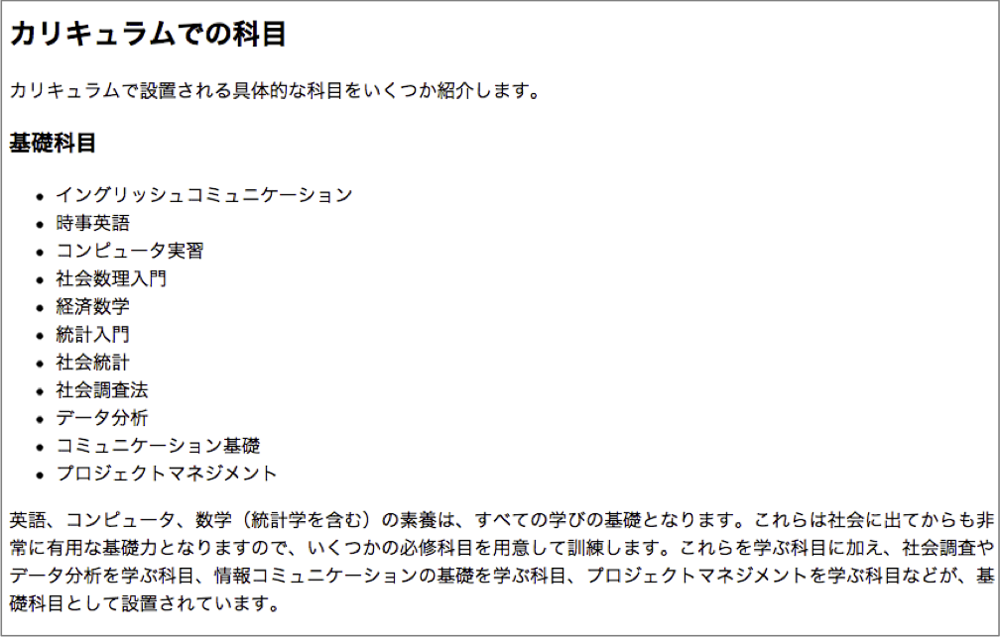
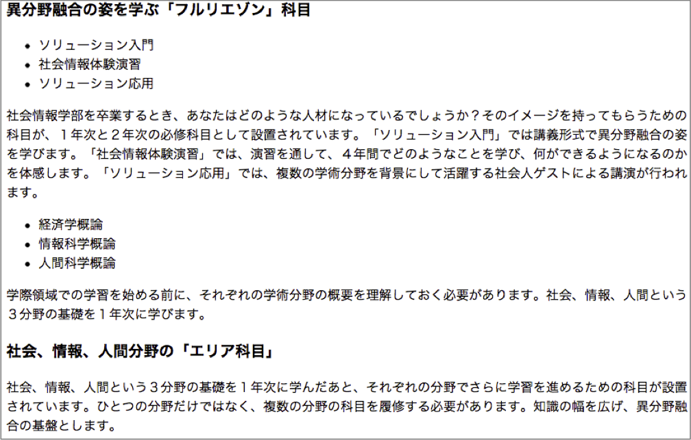
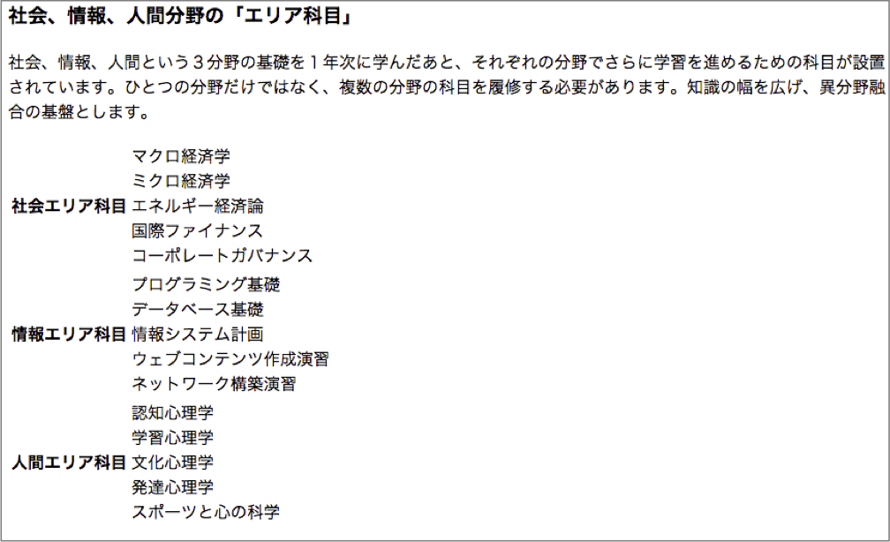
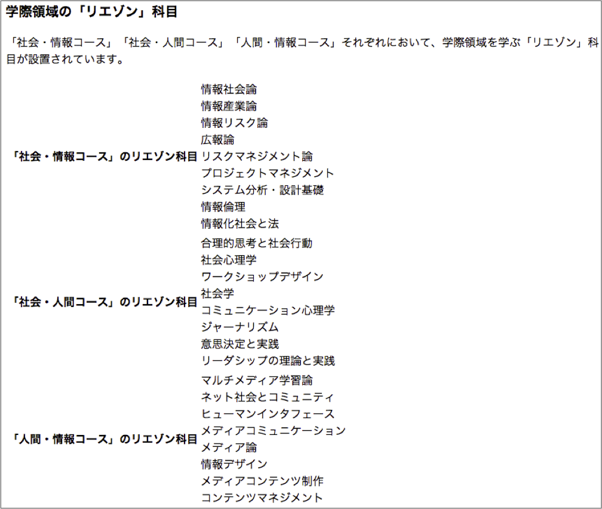
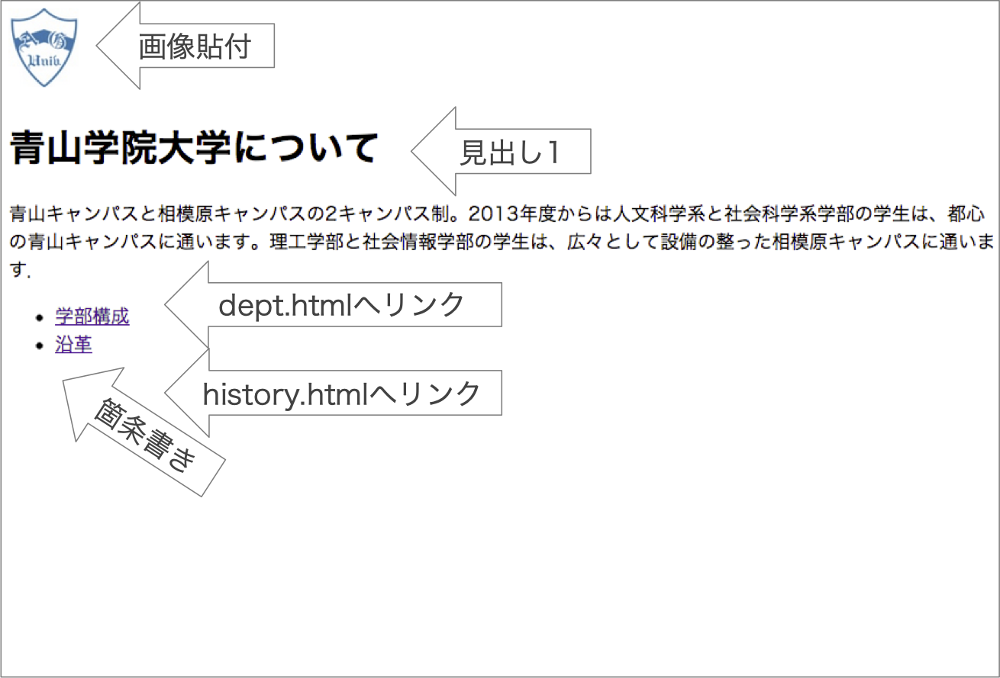
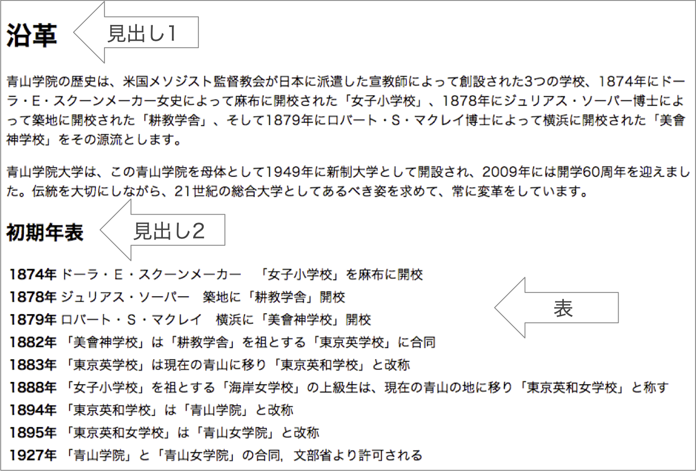
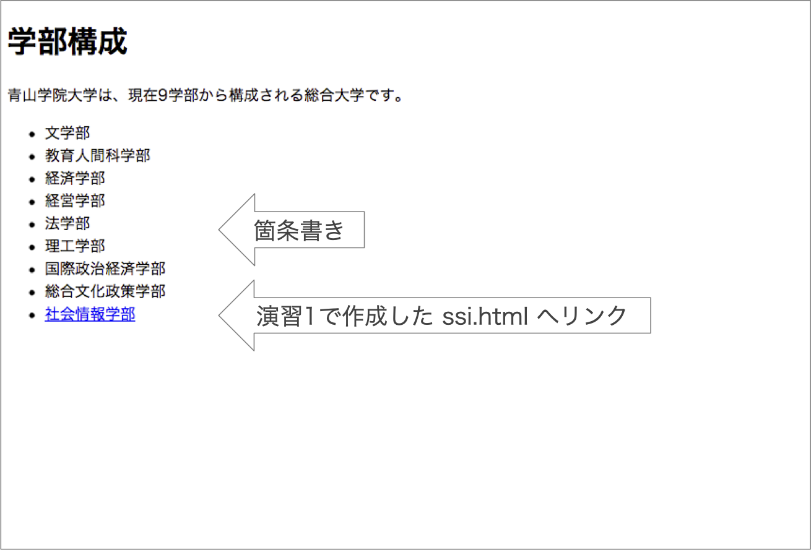

# CSSの基本

本章では，CSSファイル作成の基本について学びます．  
初学者用Webページ開発環境（pikeplace - kenya）を使って学習を進めます．  
基本的な使い方はsumatraに準じています．  

## CSS
CSS（Cascading Style Sheet）はHTMLとの組み合わせでWebページを実現する仕組みです．  
主にWebページの「見た目（スタイル）」を規定します。  

### CSSを作成する場所
CSSを作成する（記述する）場所には以下の３種類があります。

- HTML文書中にstyleタグを使って記述
- HTMLの要素にstyle属性を使って記述
- 外部ファイル（htmlとは別のファイル）として作成し，HTML文書から読み込む
  - 今回の授業では、この手法を扱う

### CSS作成時の注意
CSSファイル作成時には以下に注意してください．

- ファイルの拡張子を「.css」にする
- ファイルの文字コード（エンコーディング）を「UTF-8」にする
  - kenyaで作成する場合は自動的にUTF-8になります．

### 最初のページ（最小限の構成）
まずはkenyaにログインし，新しいフォルダを「Sample02」という名称で作成してください．  
その後，新しいファイルを「index.html」という名称で作成してください．  
index.htmlを作成したら，次の「source」のように編集してください．  

<div code src='2-1'></div>

さらに、「fitst.css」という名称で新規にファイルを作成してください。
first.cssは次の「source」のように編集してください．
```
h1{
	color: blue;
}
```
さらに、index.htmlの7行目（	&lt;title&gt;CSSの練習&lt;/title&gt;の下）に以下を追加してください．
```
<link rel="stylesheet" href="first.css">
```
最終的には以下のようなコードになります．
「練習1」の色が変化したことを確認してください。
<div code src='2-2'></div>

### CSSの構造

CSSの基本的な構造は以下のようになっています．

<table>
<tr>
  <td>
  ```
  h1{
    color: blue;
  }
  ```
  </td>
  <td>
  ```
  セレクタ{
    プロパティ: 値;
  }
  ```
  </td>
</tr>
</table>

セレクタ（見た目を変えたい場所：HTMLタグなどで指定）に対して，プロパティと値のセットを指定します．  
今回の場合は，color（プロパティ）とblue（値）の組み合わせになっています．  
つまり、上記のCSSは「h1タグ&lt;h1&gt;の文字色を青色に設定する」という意味になります．

プロパティの後はコロン（:），行の最後はセミコロン（;）です．  
プロパティに対して値が複数ある場合には，値の間をスペースで区切ります．
複数のプロパティに設定する場合は行を変えます．

セレクタとして指定できる要素は以下です．

- タグ
  - body, p, table, th, ul, などなど
- ID
  - セレクタ指定じにはIDの前に「#」をつける
- Class
  - セレクタ指定時にはclass名の前に「.」 をつける


/* と */で囲まれた部分はHTMLと同様にコメントになり，解釈・表示されません．

## 範囲指定（汎用要素）
汎用要素とは，HTML文書のなかの「ある特定の範囲」を指定するための要素です．  

- div : 汎用ブロック要素
  - 前後に改行が入る ← 段落などのまとまった範囲
- span : 汎用インライン要素
  - 前後に改行が入らない ← 文章途中などのある範囲

汎用要素には，区別するための識別子をつけます．  
識別子を利用して，「どの」要素にスタイルを適用するかを特定します．

- id : 文書中の特定の1箇所を指定する
  - 要素に固有の名前をつける＝重複できない
- class : 文書中の複数の箇所をまとめて指定する
  - 要素を分類する＝重複できる

なお、idやclassは通常のタグにもつけられます． 
使用例を以下に示します．

- divspan.html
```
  <!DOCTYPE html>
  <html lang="ja">

  <head>
	  <meta charset="UTF-8">
	  <title>CSSの練習</title>
	  <link rel="stylesheet" href="divspan.css">
  </head>

  <body>
	  <p>汎用要素の指定例</p>
	  <p>文章中の<span class="foo">この場所</span>は別のスタイル</p>
	  <p>文章中の<span id="bar">この場所</span>は上とは別のスタイル</p>

	  <p>次はdivの例です．<div id="baz">divはまとまりとしてスタイルを指定する時に使います．ただし<span class="foo">ここ</span>だけ一番上と同じスタイルとなります．divの前後は改行されます．</div>ここからdivの範囲外になります．</p>
  </body>

  </html>
```
id（bar, baz）でしている場所はそれぞれ１カ所ずつあります．  
これらはそれぞれ別のスタイルが適用されます．  

またclass（foo）で指定している場所は２カ所あります．  
これらは同じスタイルが適用されます．

- divspan.css
```
  #bar{
  	color: blue;
  }

  #baz{
	  color: red;
  }

  .foo{
	  color: green;
  }
```

実際の見た目は以下のようになります．

<div code src='2-3'></div>

## 例題1 CSSを適用する
kenyaにログインし、Sample02フォルダを作成してください．  
classroomからtest.jpgをダウンロードし、Sample02フォルダにアップロードしてください．
また，以下のようにtest01.htmlファイルを作成してください．  

<div code src='2-4'></div>

6行目で外部CSSファイルとして，「mystyle.css」を指定していることに注意してください．  
これを元にスタイルを適用していきます．


### コメント
```
/* これはコメントです */
```


### タグ
- 文章にタグを付けて構造を表す
- タグは &lt; と &gt; でくくる
    - ```<タグ名>ここに文章が入る</タグ名>```
- 「開始タグ」と「終了(閉じ)タグ」で囲まれた範囲にタグが示す構造(要素)を適用
- 終了タグが無いものも存在

- タグにはオプション指定できるものもある
    - ```<タグ名 要素名1＝”属性A” 要素名2＝”属性B”>```

### head部でよく使うタグ
```
<meta charset="UTF-8">
<meta name="description" content="HTML練習">

<title>HTMLの練習</title>

<link rel="shortcut icon" href="myfavicon.ico">
<link rel="stylesheet" href="mystyle.css">
<script src="myscript.js"></script>
```

### コメント
```
<!-- これはコメントです -->
```

- &lt;!-- と --&gt;で囲まれた部分はコメント，解釈・表示されない

### 実体参照

<!-- | 文字           | 実体参照       | 説明            |
:--|:-:|--:
| &lt; | &amp;lt;         | 小なり記号       |
| &gt; | &amp;gt;         | 大なり記号  |
| &amp;| &amp;amp;         | アンド記号    |
| &quot;| &amp;quot;  | ダブルクォーテーション    |
: 特殊記号の表示 -->

<table class="mtable" style="margin-left: 100px;">
<tr>
    <td class="mtd">文字</td>
    <td class="mtd">実体参照</td>
    <td class="mtd" style="width: 200px;">説明</td>
</tr>
<tr>
    <td>&lt;</td><td>&amp;lt;</td><td>小なり記号</td>
</tr>
<tr>
    <td>&gt;</td><td>&amp;gt;</td><td>大なり記号</td>
</td>
<tr>
    <td>&amp;</td><td>&amp;amp;</td><td>アンド記号</td>
</tr>
<tr>
    <td>&quot;</td><td>&amp;quot;</td><td>ダブルクォーテーション</td>
</tr>
</table>

## body部で利用するタグ

<div code src='1-2'></div>

- 見出しは h1（大見出し） から h6（小見出し） まで．  
- パラグラフは&lt;p> &lt;/p>でくくる．
- 希望位置で改行したい場合には&lt;br>を利用（閉じタグ無し）．

### 画像を貼る

画像を利用する場合には事前にWebサーバにアップロードしておく必要があります．  
本演習では，以下の手順でkenyaサーバに画像をアップロードしておきます．  

1. 「up」をクリックする
1. 「ファイルを選択」をクリックし，画像をアップロードする
1. アップロードされたことを確認する



その後，以下のように&lt;img&gt;タグを用いて画像を貼ります．

<div code src='1-7'></div>
- srcにファイル名を，altには画像の説明を付ける
- 画像ファイルは，GIF, JPEG, PNGの形式


### リンクする

<div code src='1-3'></div>

- オプション target="_blank" を付けると別ウィンドウ（タブ）で開く

### 箇条書き

<div code src='1-4'></div>


### 段落番号

<div code src='1-5'></div>

- ul : Unordered List (順序のないリスト) → 箇条書きリスト  
- ol : Ordered List (順序のあるリスト) → 番号付きリスト  
- li : List Item (リストの項目)

### 表

<div code src='1-6'></div>


- tr : 行の指定
- th : 見出しの指定  
- td : 列（データ）の指定  

### その他：学習に関して
- 日常的に作業しない場合，全てのタグやオプションを覚えることは困難
  - 必要に応じて調べながら使えれば良い
- 例題の多い辞書的なサイトが参考に
  - HTMLクイックリファレンス　[http://www.htmq.com/](http://www.htmq.com/) 
  - HTML5やCSSプロパティなど
- お手本となるサイトのソースを覗く
  - 実際のイメージから，どのように実現しているのか


## 練習問題
### 練習問題8-1
配布ファイルssi.txtの内容を使い，以下の表示例と同様の出力が可能なssi.htmlを作成せよ

- 表示例（1）
  - 
- 表示例（2）
  - 
- 表示例（3）
  - 
- 表示例（4）
  - 
- 表示例（5）
  - 
- ただし，見出しの設定と表の構成は次に従うこと
  - 見出しの設定
    - h1 :「社会情報学部の教育」
    - h2 :「学際的融合領域を学ぶ」「カリキュラムでの科目」
    - h3 : それ以外の見出し部分
  - 表示例（4）の表の構成
    - 表の周りの線や色が無いためわかりづらいので，わかりやすくするために色づけした表を以下に示す
	- このように3行2列の表を作成する（実際には色付けは不要である）
	  - 
 - 表示例（5）の表も同様に2行3列である
 - どの行にどの科目が入るのかは，ssi.txtファイルを参照すること

### 練習問題8-2
3つのHTMLファイルからなる青山学院大学を説明するWebページを作成せよ

- ただし、文章はagu.txtを利用すること
- ページの構成は以下のようにすること
  - index.html : トップページ
  - dept.html : 学部について書かれたページ
  - history.html : 沿革について書かれたページ
  - 画像：test.jpgを利用する
- index.htmlの表示例
  - 
- history.htmlの表示例
  - 
- dept.htmlの表示例
  - 


