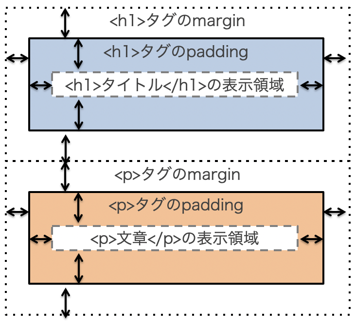
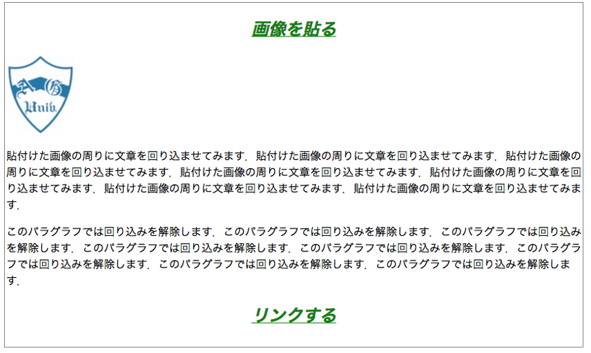
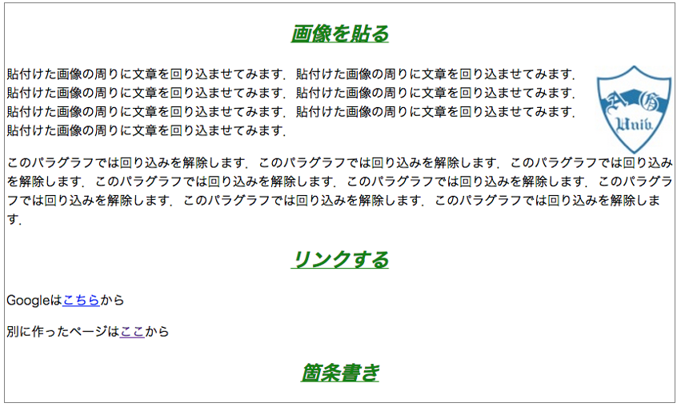
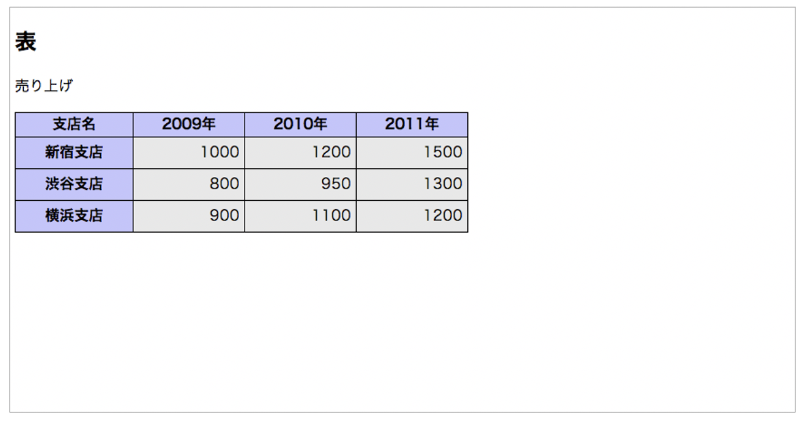
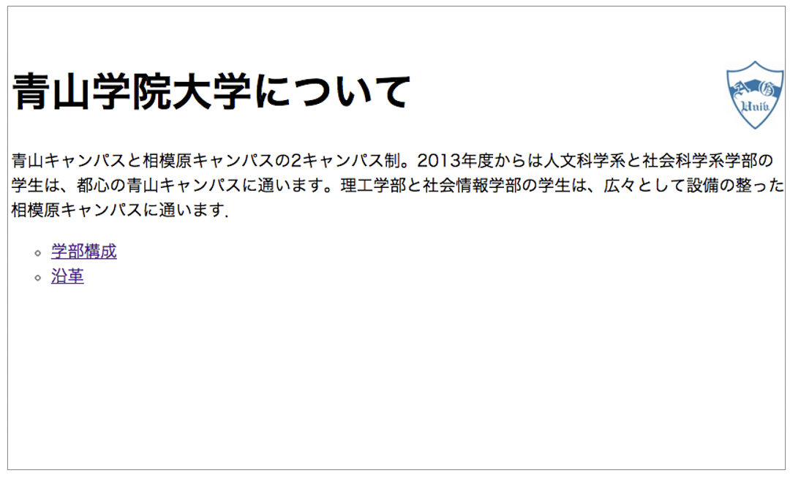

# CSSの基本

本章では，CSSファイル作成の基本について学びます．  
初学者用Webページ開発環境（pikeplace - kenya）を使って学習を進めます．  
基本的な使い方はsumatraに準じています．  

## CSS
CSS（Cascading Style Sheet）はHTMLとの組み合わせでWebページを実現する仕組みです．  
主にWebページの「見た目（スタイル）」を規定します。  

### CSSを作成する場所
CSSを作成する（記述する）場所には以下の３種類があります。

- HTML文書中にstyleタグを使って記述
- HTMLの要素にstyle属性を使って記述
- 外部ファイル（htmlとは別のファイル）として作成し，HTML文書から読み込む
  - 今回の授業では、この手法を扱う

### CSS作成時の注意
CSSファイル作成時には以下に注意してください．

- ファイルの拡張子を「.css」にする
- ファイルの文字コード（エンコーディング）を「UTF-8」にする
  - kenyaで作成する場合は自動的にUTF-8になります．

### 最初のページ（最小限の構成）
まずはkenyaにログインし，新しいフォルダを「Sample02」という名称で作成してください．  
その後，新しいファイルを「index.html」という名称で作成してください．  
index.htmlを作成したら，次の「source」のように編集してください．  

<div code src='2-1'></div>

さらに、「fitst.css」という名称で新規にファイルを作成してください。
first.cssは次の「source」のように編集してください．
```
h1{
	color: blue;
}
```
さらに、index.htmlの7行目（	&lt;title&gt;CSSの練習&lt;/title&gt;の下）に以下を追加してください．
```
<link rel="stylesheet" href="first.css">
```
最終的には以下のようなコードになります．
「練習1」の色が変化したことを確認してください。
<div code src='2-2'></div>

### CSSの構造

CSSの基本的な構造は以下のようになっています．

<table>
<tr>
  <td>
  ```
  h1{
    color: blue;
  }
  ```
  </td>
  <td>
  ```
  セレクタ{
    プロパティ: 値;
  }
  ```
  </td>
</tr>
</table>

セレクタ（見た目を変えたい場所：HTMLタグなどで指定）に対して，プロパティと値のセットを指定します．  
今回の場合は，color（プロパティ）とblue（値）の組み合わせになっています．  
つまり、上記のCSSは「h1タグ&lt;h1&gt;の文字色を青色に設定する」という意味になります．

プロパティの後はコロン（:），行の最後はセミコロン（;）です．  
プロパティに対して値が複数ある場合には，値の間をスペースで区切ります．
複数のプロパティに設定する場合は行を変えます．

セレクタとして指定できる要素は以下です．

- タグ
  - body, p, table, th, ul, などなど
- ID
  - セレクタ指定時にはIDの前に「#」をつける
- クラス
  - セレクタ指定時にはclass名の前に「.」 をつける


/* と */で囲まれた部分はHTMLと同様にコメントになり，解釈・表示されません．

### 範囲指定（汎用要素）
汎用要素とは，HTML文書のなかの「ある特定の範囲」を指定するための要素です．  

- div : 汎用ブロック要素
  - 前後に改行が入る ← 段落などのまとまった範囲
- span : 汎用インライン要素
  - 前後に改行が入らない ← 文章途中などのある範囲

汎用要素には，区別するための識別子をつけます．  
識別子を利用して，「どの」要素にスタイルを適用するかを特定します．

- id : 文書中の特定の1箇所を指定する
  - 要素に固有の名前をつける＝重複できない
- class : 文書中の複数の箇所をまとめて指定する
  - 要素を分類する＝重複できる

なお、idやclassは通常のタグにもつけられます． 
使用例を以下に示します．

- divspan.html
```
  <html>

  <head>
	  <title>CSSの練習</title>
	  <link rel="stylesheet" href="divspan.css">
  </head>

  <body>
	  <p>汎用要素の指定例</p>
	  <p>文章中の<span class="foo">この場所</span>は別のスタイル</p>
	  <p>文章中の<span id="bar">この場所</span>は上とは別のスタイル</p>

	  <p>次はdivの例です．<div id="baz">divはまとまりとしてスタイルを指定する時に使います．ただし<span class="foo">ここ</span>だけ一番上と同じスタイルとなります．divの前後は改行されます．</div>ここからdivの範囲外になります．</p>
  </body>

  </html>
```
id（bar, baz）でしている場所はそれぞれ１カ所ずつあります．  
これらはそれぞれ別のスタイルが適用されます．  

またclass（foo）で指定している場所は２カ所あります．  
これらは同じスタイルが適用されます．

cssファイル内でのID、クラスの指定は以下のように行います．

- ID
  - 識別子idで指定した名前の先頭に「#」をつける
  - 例：#bar, #baz
- クラス
  - 識別子classで指定した名前の先頭に「.」をつける
  - 例：.foo

```
/* divspan.css の記述例*/

  #bar{
  	color: blue;
  }

  #baz{
	  color: red;
  }

  .foo{
	  color: green;
  }
```

実際の見た目は以下のようになります．

<div code src='2-3'></div>

## 例題1 CSSを適用する
kenyaにログインし、Sample02フォルダを作成してください．  
classroomからtest.jpgをダウンロードし、Sample02フォルダにアップロードしてください．  
また，以下のようにtest01.htmlファイルを作成してください．  

<div code src='2-4'></div>

6行目で外部CSSファイルとして，「mystyle.css」を指定していることに注意してください．  
これを元にスタイルを適用していきます．

### mystyle.cssファイルの作成
mystyle.cssファイルを作成し，以下の内容（左側）を作成してください．  
<table>
  <tr>
  <td>
```
/* mystyle.css */

h1{
	color: blue;
	font-size: 40px;
}
```
  </td>
  <td>
```
mystyle.cssの説明

h1タグに対して{
  色を青色に
  フォントサイズを40pxに
}
```
  </td>
  </tr>
</table>

- test01.htmlの表示例
  - 

## 例題2 様々なスタイルを適用する
以下では様々なスタイルについて説明しますが、全を解説するわけではありません．  
詳細を知りたい人は，先週紹介したHTMLクイックリファレンス（[http://www.htmq.com/](http://www.htmq.com) ）などを参照のこと．

### テキストのスタイル：タグへの適用

まず最初にh2タグにスタイルを適用します（見た目を変更します）．  
mystyle.cssに以下を追記してください．

<table>
  <tr>
  <td>
```
/* mystyle.cssに追記 */

h2{
	color: green;
	font-size: 25px;
	font-weight: bold;
	font-style: italic;
	text-align: center;
	text-decoration: underline;
}

```
  </td>
  <td>
```
mystyle.cssの説明

h2タグに関して{
 色を緑に
 フォントサイズを25pxに
 フォントを太字に
 フォントをイタリックに
 テキストの場所をセンタリング
 テキストはアンダーラインで装飾
}
```
  </td>
  </tr>
</table>

- test01.htmlの表示例
  - 

### テキストのスタイル：ID，クラスへの適用
最初にtest01.htmlファイルにIDとクラスを設定します．

<table>
  <tr>
  <td>
```
<body>
<p class="attention">最小限の構成</p>

<h1>ようこそ</h1>
<p id="underline20">この部分に文章を書いていきます。</p>

<h2>改行の方法</h2>

<p>この文の直後で改行する。<br><span class="attention">改行</span>しました。</p>

<h2>画像を貼る</h2>
```
  </td>
  <td>
```

このpタグ要素に「attention」クラスを設定


このpタグ要素に「underline20」IDを設定


このspanで囲まれた部分に対して「attention」クラスを設定
文章の一部のみを指定したいためspanを利用している


```
  </td>
  </tr>
</table>

次に，mystyle.cssファイルに追記します．

<table>
  <tr>
  <td>
```
#underline20{
	font-size: 20px;
	text-decoration: underline;
}

.attention{
	color: red;
	font-size: 24px;	
}
```
  </td>
  <td>
```
underline20というIDに対して
 フォントサイズを20px
 テキストにアンダーライン


attentionというクラスに対して
 文字色を赤
 フォントサイズを24px


```
  </td>
  </tr>
</table>

- test01.htmlの表示例
  - 

### ブロック要素のスタイル
段落など文章のまとまりを指定したい場合にはdivタグを用いて指定します．  
test01.htmlに以下のように追記してください．

<table>
  <tr>
  <td>
```
<body>
<p class="attention">最小限の構成</p>

<h1>ようこそ</h1>
<p id="underline20">この部分に文章を書いていきます。</p>

<div id="block">
この部分はblockというIDが付けられている。
</div>
```
  </td>
  <td>
```


文章を追記し，その文章の範囲に「block」IDを設定


```
  </td>
  </tr>
</table>


さらにmystyle.cssに以下を追記します．
<table>
  <tr>
  <td>
```
#block{
    background-color: aqua;
    width: 30%;
    height: 50px;
    
    border-color: grey;
    border-width: 5px;
    border-style: solid; 
　/* solid の他に double; dotted; 
　　dashed; inset; outset; が指定できる*/
}

```
  </td>
  <td>
```
 block01というIDに対して
 背景色を水色に
 横幅は，表示領域の30％
 高さは，50px

 範囲の枠の色を灰色に
 枠の幅は5px
 枠線は通常の線


```
  </td>
  </tr>
</table>

- test01.htmlの表示例
  - 


### 余白：マージンとパディング


要素ごとに余白（マージン、パディング）を設定できます．

- マージン
  - 要素の【外側】の余白
- パディング
  - 要素の【内側】の余白

test01.htmlに以下のように追記してください．

<table>
  <tr>
  <td>
```
<div id="block">
この部分はblockというIDが付けられている。
</div>

<div id="b01">
この部分はb01
</div>

<div id="b02">
この部分はb02
</div>

```
  </td>
  <td>
```


文章を追記し，その文章の範囲に「b01」IDを設定


文章を追記し，その文章の範囲に「b02」IDを設定


```
  </td>
  </tr>
</table>


さらにmystyle.cssに以下を追記します．
<table>
  <tr>
  <td>
```
#b01{
  background-color: #b0b9a9;
  margin: 50px;
  padding: 5px 0px 25px 20px;
}

#b02{
  background-color: #89709f;
  margin: 0px;
  padding: 0px;
}


```
  </td>
  <td>
```
 b01というIDに対して
 背景色を16進数で指定
 marginは上下左右50px
 paddingは，上5px, 右0px, 
                   下25px, 左20px

 b02というIDに対して
 背景色を16進数で指定
 marginは上下左右0px
 paddingは上下左右0px


注： 文字周り横の余白ではない
注： 一個値を設定：上下左右が均等
注： 二個値を設定：上下，左右 の設定
注： 四個値を設定：上,右,下,左の順の指定
```
  </td>
  </tr>
</table>

- test01.htmlの表示例
  - 


### リストのスタイル

リストに特有のスタイルには以下があります． 

- ul
  - { list-style-type: square; } ← 四角に
    - none マーク無し
    - circle 白丸
- ol
  - { list-style-type: hiragana; } ← ひらがな
    - lower-alpha 小文字アルファベット
    - lower-roman 小文字のローマ数字

などです（調べてみましょう）．  
各自、どのような見た目になるかを確かめてみてください．

### 擬似クラス
指定の要素が特定の状態である場合にスタイルを適用させるセレクタを擬似クラスと呼びます．  
もう少しわかりやすくいうと、ユーザの何かの動作をきっかけにクラスが割り当てられる仕組みといえます．  
要素の後ろに「:」をつけ，状態を記述します．

例えば以下のような使い方をします．

<table>
  <tr>
  <td>
```
/* HTMLファイルの例 */

<body>

<h1>あいさつ</h1>

<ul id="greet">
<li>おはよう！</li>
<li>こんにちは！/li>
<li>こんばんは！</li>
</ul>

<span class="person">青山さん！</span>

</body>


```
  </td>
  <td>
```
/* cssファイルの例 */


li:last-child {
    color: green;
}
/*
リストの最後の要素に色をつける
*/

.person:hover {
    color: red;
}
/*
personクラスにマウスオーバーしたら色を赤に
*/
```
  </td>
  </tr>
</table>

### セレクタの高度な指定方法
複数のセレクタの指定の仕方にはいくつかの方法が存在します．
例を載せておくので，一度試してみてください．

- カンマで区切る　#id, .class
  - 前のセレクタと後のセレクタの双方にスタイルを適用
- スペースで区切る #id .class
  - 後のセレクタが前のセレクタの下位の要素である場合にはスタイルを適用（子要素，孫要素）
- 大なりで区切る #id>.class
  - 後のセレクタが前のセレクタの子要素である場合には，スタイルを適用（孫要素の場合には適用されない）
- 区切らず，つなげた場合 span.foo
  - span要素のうち，classがfooのモノのみ適用

またセレクタの優先順位は次のようになります．  
（上の方が優先度が高い）

1. importantがついているものが優先
1. 詳細に指定した方が優先
1. idの方がclassより優先
1. 後から書いた方が優先

### 文字の回り込み
文字の回り込みは以下のように記述します．

- HTML
  - 文字を回り込ませたい要素にIDやクラスを指定
- CSS
  - その要素をfloat命令でどこに置くのかを指定（例：left, right）

また，文字の回り込みの設定は<font color="Red">【明示的に設定を解除するまでそのままです】．</font>  
解除は以下のように記述します．

- HTML
  - 解除させたい場所にIDやクラスを指定
- CSS
  - その要素にclear命令で何を打ち消すかを指定
  - 全て（leftやrightなど）打ち消したければ"both"を指定

以下にそれらの例を示します．

- test01.htmlの表示例（回り込み設定<font color="Red">前</font>）
  - 
  
上記は回り込み設定の前の状態です．  
ここに以下の設定を追加します．  
まずはHTMLファイルです．
<table>
  <tr>
  <td>
```
<h2>画像を貼る</h2>


<p>
貼付けた画像の周りに文章を回り込
…省略…
</p>

<p class="clr">
このパラグラフでは回り込みを解
…省略…
</p>

```
  </td>
  <td>
```

画像（回り込ませたい要素）に「ar」IDを設定


文章（回り込みを解除したい）の範囲に「clr」クラスを設定


```
  </td>
  </tr>
</table>

次にCSSファイルです．
<table>
  <tr>
  <td>
```
#ar{
	float: right;
}

.clr{
	clear: both;
}

```
  </td>
  <td>
```
arというIDに対して
  位置を右側に


clrというクラス（以降）に対して
　位置設定をクリア


```
  </td>
  </tr>
</table>


- test01.htmlの表示例（回り込み設定<font color="Red">後</font>）
  - 

回り込み設定をすることで画像の左側に文字が回り込んでいるのがわかると思います．  
また，回り込み解除後は元に戻っています．  
余裕がある人は，&lt;p class="clr"&gt;を元の&lt;p&gt;に戻してみて、文字の回り込みがどうなるかを確認してみてください．

### レイアウト
文字の回り込みの応用でレイアウトの変更ができます．  
新規ファイルとしてtest02.htmlを作成し，以下のように記述してください．   
ここではtest02.cssを呼び出すように記述していますので，このtest02.cssファイルを作成していきます．  

<div code src='2-5'></div>

test02.htmlファイルには以下のように予めIDが指定されています．  
このIDを利用してレイアウトを作成します．

<table>
  <tr>
  <td>
```
<body>
 <div id="all">

　<div id="hdr">
　　<h1>タイトル</h1>
　</div>

　<div id="main">
　　<h2>表</h2>
　</div>

   <div id="side">
　　<p>Menu</p>
　</div>

　<div id="ftr">
　　<p>青山学院大学 社会情報学部</p>
　</div>

 </div>
</body>
```
  </td>
  <td>
```
全体を「all」IDに設定


タイトル部を「hdr」IDに設定


メインとなる部分を「main」IDに設定


Menu(箇条書き)を「side」IDに設定


下に付ける部分を「ftr」IDに設定


```
  </td>
  </tr>
</table>


test02.cssファイルを以下のように作成します．
<table>
  <tr>
  <td>
```
*{
	margin: 0px;
}


body{
	width:100%;
}

#all{
	margin: 0px auto;
	width: 750px;
}

#hdr{
	width: 100%;
      background-color: teal;
}

#main{
    float: left;
    width: 500px;
    background-color: olive;
}

#side{
    float: right;
    width: 250px;
    background-color: green;
}

#ftr{
    clear: both;
    width: 100%;
    background-color: lime;
}

```
  </td>
  <td>
```
全てに対して
	marginを0pxに設定
(レイアウトを組むとき，様々なタグのマージンが影響するため⇒無効化)


body部に対して
	幅をブラウザの100％幅で


ID「all」（中身全体の範囲）に対して
	上下のマージンを0に，左右を自動．
	幅を750pxに
（ブラウザの幅を変更しても中身全体の部分は750pxで固定，中央に位置され左右の空白が均等に自動で変更される）

ID「hdr」部に対して
 	幅を100％に
（hdrはallの中に含まれているので，allの幅の100%となる）


ID「main」に対して
	位置を左
	幅を500px


ID「side」に対して
	位置を右
	幅を250px


 ID「ftr」部に対して
 	位置設定を解除
	幅を100％に
（ftrはallの中に含まれているので，allの幅の100%となる）


```
  </td>
  </tr>
</table>

- test02.htmlの表示例
  - 


上記表示例では、すべてのマージンを0pxにしてしまったため，全体的に詰まった印象を受けます．  
これはpaddingなどで調整しましょう．  
また左右の要素の高さが不揃いな部分があります．  
これは本質的には変えることができないので、背景色や枠線で調整します．
<table>
  <tr>
  <td>
```
h1, h2{
	padding: 5px 10px;
}

table, p{
	padding: 10px;
}


ul{
	padding: 5px 0px 5px 40px;
}


```
  </td>
  <td>
```
h1とh2の要素に対して
	パディング 上下 5px ，左右10px


tableとpの要素に対して
	パディングを上下左右10px


ulに対して
	パディングを 
　　　上5px，右0px, 
　　　下5px，左40pxに設定
```
  </td>
  </tr>
</table>

- test02.htmlの表示例
  - 

最後に、全体的に色合いを調整します．  
#hdrと#ftrの色を揃え，他の部分も適宜修正します．  
また，中央右に空白部分が存在しますが，これは全体の背景色と#sideの色を揃えることで見えなくします．
<table>
  <tr>
  <td>
```
#all{
	margin: 0px auto;
	width: 750px;
	background-color: #fbc7c7;
}

中略

#side{
	float: right;
      width: 250px;
      background-color: #fbc7c7;
}

略

```
  </td>
  <td>
```
all の色を追加
	色は，一番短い要素と同じ色

この場合 side部が短いので，それと同じ色に設定


ついでにsideの色も変更してみました．


省略していますが，hdrとftrの色を揃え，body部も落ち着いた色に変更しています．

```
  </td>
  </tr>
</table>

 - test02.htmlの表示例
  - 


### 表のスタイル
表に対してスタイルを適用することもできます.
test03.htmlを新規作成し，以下を記述してください．

<div code src='2-6'></div>


test03.cssを以下のように作成します．

<table>
  <tr>
  <td>
```
table{	
	width: 500px;
      border-collapse: collapse;
}

th{
	border: 1px solid black;
	background-color: #c5c5f8;
	text-align: center;
	vertical-align: middle;
}

td{
	border: 1px solid black;
	background-color: #e8e8e8;
	text-align: right;
	vertical-align: middle;
	padding: 5px;
}
```
  </td>
  <td>
```
表に対して
	幅は500px
	線は重ねて表示


表の見出し部について
	線設定（太さ，種類，色）
　　背景色設定
　　文字の横方向位置を中央
　　縦方向の位置を中央

表の見出し部について
	線設定（太さ，種類，色）
　　背景色設定
　　文字の横方向位置を右側
　　縦方向の位置を中央
　　パディング上下左右5px


```
  </td>
  </tr>
</table>

 - test03.htmlの表示例
  - 


## 練習問題9-1
Kadai09フォルダを作成してください．  
classroomからtest.jpgをダウンロードし，Kadai09フォルダにアップロードしてください．  
また、index.html, history.html, dept.htmlの3つのファイルを作成してください．  
それぞれのファイルには以下を記述してください．

<div code src='index'></div>
　　
<div code src='history'></div>

<div code src='dept'></div>

上記3つのhtmlファイルを作成後，以下の仕上がり例に近づくよう，htmlファイルの修正及びcssファイル（e02.css）の作成をして下さい．

- index.htmlの表示例
  - 

- history.htmlの表示例
  - 

- dept.htmlの表示例
  - 

## 練習問題9-2
Kadai09フォルダにssi.htmlファイルを新規作成し，以下の内容を記述してください．

<div code src='ssi'></div>

以下の仕上がりに近づくよう，ssi.cssを作成して下さい．  
ただし，ssi.htmlファイルは，なにも修正しないこと．

- ssi.htmlの表示例
  - 
  - 
  - 
